# 演讲比赛流程管理系统

## 1、 演讲比赛程序需求


### 1.1 比赛规则

* 学校举行一场演讲比赛，共有**12个人**参加。**比赛共两轮**，第一轮为淘汰赛，第二轮为决赛。
* 比赛方式：**分组比赛，每组6个人**；选手每次要随机分组，进行比赛
* 每名选手都有对应的**编号**，如 10001 ~ 10012 
* 第一轮分为两个小组，每组6个人。 整体按照选手编号进行**抽签**后顺序演讲。
* 当小组演讲完后，淘汰组内排名最后的三个选手，**前三名晋级**，进入下一轮的比赛。
* 第二轮为决赛，**前三名胜出**
* 每轮比赛过后需要**显示晋级选手的信息**

### 1.2 程序功能

* 开始演讲比赛：完成整届比赛的流程，每个比赛阶段需要给用户一个提示，用户按任意键后继续下一个阶段
* 查看往届记录：查看之前比赛前三名结果，每次比赛都会记录到文件中，文件用.csv后缀名保存
* 清空比赛记录：将文件中数据清空
* 退出比赛程序：可以退出当前程序

### 1.3 程序效果图：

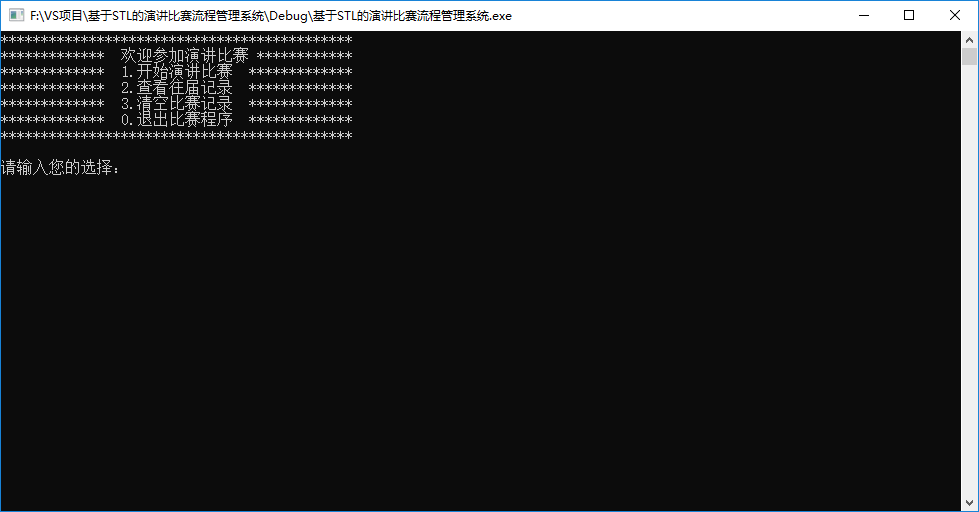


## 2、 项目创建

创建项目步骤如下：

- 创建新项目
- 添加文件


### 2.1 创建项目

* 打开vs2017后，点击创建新项目，创建新的C++项目

如图：

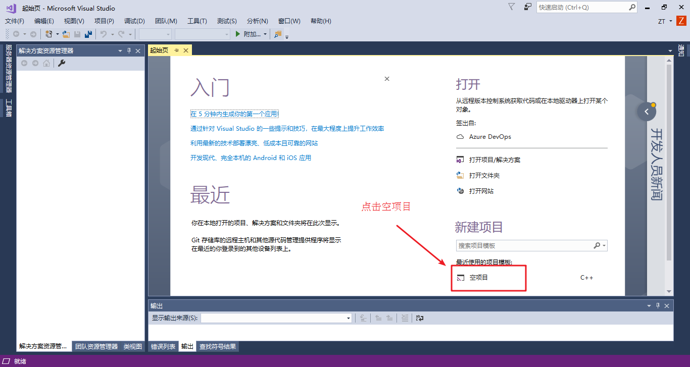


* 填写项目名称以及选取项目路径，点击确定生成项目


### 2.2 添加文件

* 右键源文件，进行添加文件操作

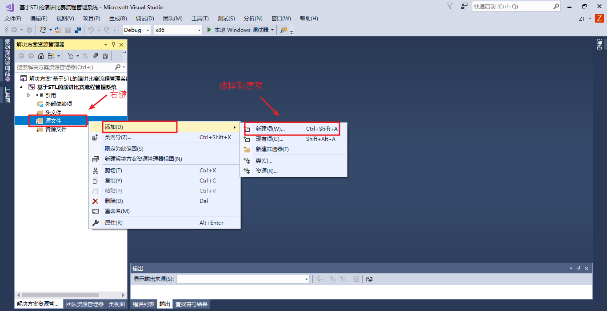

* 填写文件名称，点击添加


* 生成文件成功，效果如下图

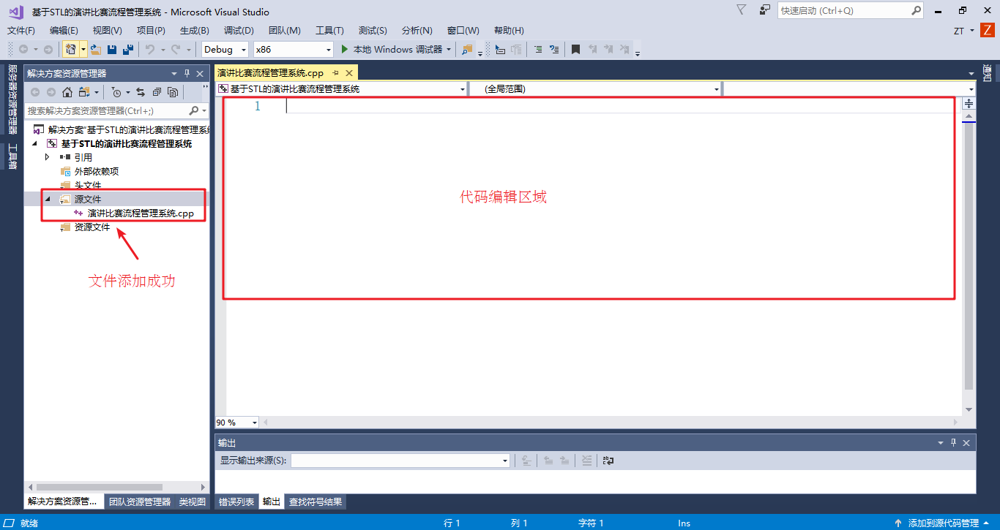


* 至此，项目已创建完毕


## 3、 创建管理类

**功能描述：**

- 提供菜单界面与用户交互
- 对演讲比赛流程进行控制
- 与文件的读写交互


### 3.1创建文件

* 在头文件和源文件的文件夹下分别创建speechManager.h 和 speechManager.cpp文件

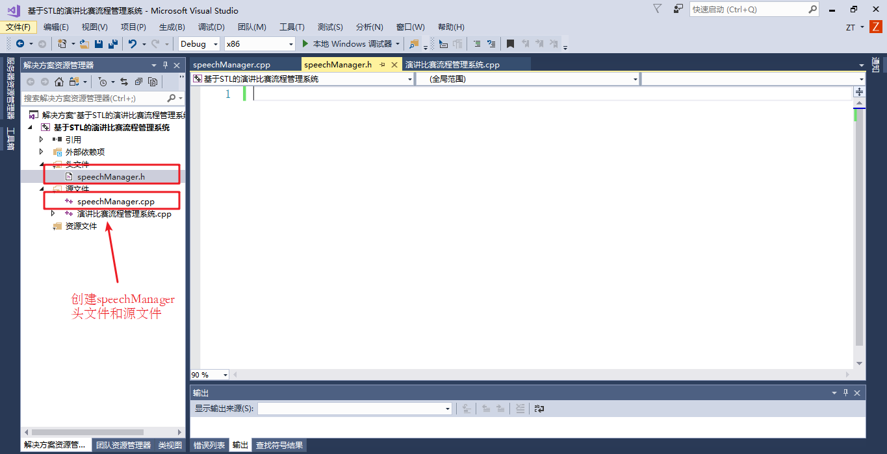


### 3.2 头文件实现

在speechManager.h中设计管理类

代码如下：

```c++
#pragma once
#include<iostream>
using namespace std;

//演讲管理类
class SpeechManager
{
public:

	//构造函数
	SpeechManager();


	//析构函数
	~SpeechManager();
};
```

### 3.3 源文件实现

在speechManager.cpp中将构造和析构函数空实现补全

```c++
#include "speechManager.h"

SpeechManager::SpeechManager()
{
}

SpeechManager::~SpeechManager()
{
}
```

* 至此演讲管理类以创建完毕


## 4、 菜单功能

功能描述：与用户的沟通界面

### 4.1 添加成员函数

在管理类speechManager.h中添加成员函数  `void show_Menu();`

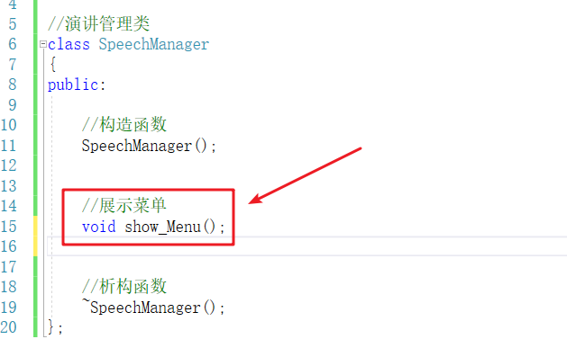

 


### 4.2 菜单功能实现

* 在管理类speechManager.cpp中实现 show_Menu()函数

```c++
void SpeechManager::show_Menu()
{
	cout << "********************************************" << endl;
	cout << "*************  欢迎参加演讲比赛 ************" << endl;
	cout << "*************  1.开始演讲比赛  *************" << endl;
	cout << "*************  2.查看往届记录  *************" << endl;
	cout << "*************  3.清空比赛记录  *************" << endl;
	cout << "*************  0.退出比赛程序  *************" << endl;
	cout << "********************************************" << endl;
	cout << endl;
}
```


### 4.3 测试菜单功能

* 在演讲比赛流程管理系统.cpp中测试菜单功能

代码：

```c++
#include<iostream>
using namespace std;
#include "speechManager.h"

int main() {

	SpeechManager sm;

	sm.show_Menu();

	system("pause");

	return 0;
}
```

* 运行效果如图：

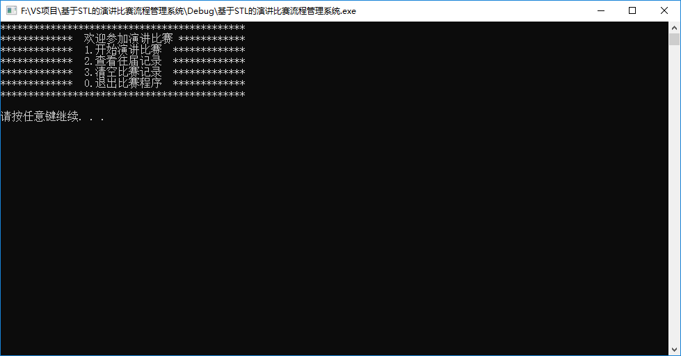

* 菜单界面搭建完毕


## 5、 退出功能

### 5.1  提供功能接口

* 在main函数中提供分支选择，提供每个功能接口

代码：

```c++
int main() {

	SpeechManager sm;

	int choice = 0; //用来存储用户的选项

	while (true)
	{
		sm.show_Menu();

		cout << "请输入您的选择： " << endl;
		cin >> choice; // 接受用户的选项

		switch (choice)
		{
		case 1:  //开始比赛
			break;
		case 2:  //查看记录
			break;
		case 3:  //清空记录
			break;
		case 0:  //退出系统
			break;
		default:
			system("cls"); //清屏
			break;
		}
	}

	system("pause");

	return 0;
}
```


### 5.2 实现退出功能

在speechManager.h中提供退出系统的成员函数 `	void exitSystem();`

在speechManager.cpp中提供具体的功能实现

```c++
void SpeechManager::exitSystem()
{
	cout << "欢迎下次使用" << endl;
	system("pause");
	exit(0);
}
```


### 5.3测试功能

在main函数分支 0  选项中，调用退出程序的接口

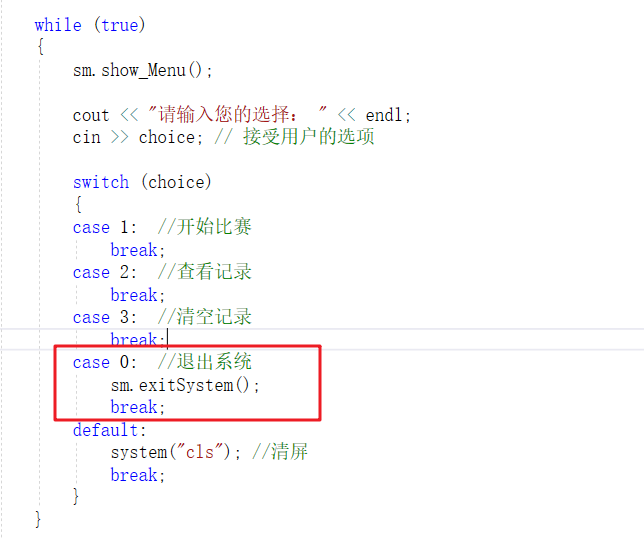


运行测试效果如图：


## 6、演讲比赛功能

### 6.1 功能分析

比赛流程分析：

抽签 → 开始演讲比赛 → 显示第一轮比赛结果 → 

抽签 → 开始演讲比赛 → 显示前三名结果 → 保存分数


### 6.2 创建选手类

* 选手类中的属性包含：选手姓名、分数
* 头文件中创建 speaker.h文件，并添加代码：

```C++
#pragma once
#include<iostream>
using namespace std;

class Speaker
{
public:
	string m_Name;  //姓名
	double m_Score[2]; //分数  最多有两轮得分
};
```


### 6.3 比赛

#### 6.3.1 成员属性添加

* 在speechManager.h中添加属性

```C++
	//比赛选手 容器  12人
	vector<int>v1;

	//第一轮晋级容器  6人
	vector<int>v2;

	//胜利前三名容器  3人
	vector<int>vVictory;

	//存放编号 以及对应的 具体选手 容器
	map<int, Speaker> m_Speaker;
```


#### 6.3.2 初始化属性

- 在speechManager.h中提供开始比赛的的成员函数 `void initSpeech();`

```c++
	//初始化属性
	void initSpeech();
```


- 在speechManager.cpp中实现`void initSpeech();`

```c++
void SpeechManager::initSpeech()
{
	//容器保证为空
	this->v1.clear();  
	this->v2.clear();
	this->vVictory.clear();
	this->m_Speaker.clear();
	//初始化比赛轮数
	this->m_Index = 1;
}
```


- SpeechManager构造函数中调用`void initSpeech();`

```c++
SpeechManager::SpeechManager()
{
	//初始化属性
	this->initSpeech();
}
```


#### 6.3.3 创建选手

* 在speechManager.h中提供开始比赛的的成员函数 `void createSpeaker();`

```C++
	//初始化创建12名选手
	void createSpeaker();
```


* 在speechManager.cpp中实现`void createSpeaker();`

```C++
void SpeechManager::createSpeaker()
{
	string nameSeed = "ABCDEFGHIJKL";
	for (int i = 0; i < nameSeed.size(); i++)
	{
		string name = "选手";
		name += nameSeed[i];

		Speaker sp;
		sp.m_Name = name;
		for (int i = 0; i < 2; i++)
		{
			sp.m_Score[i] = 0;
		}

		//12名选手编号
		this->v1.push_back(i + 10001);

		//选手编号 以及对应的选手 存放到map容器中
		this->m_Speaker.insert(make_pair(i + 10001, sp));
	}
}
```


* SpeechManager类的 构造函数中调用`void createSpeaker();`

```C++
SpeechManager::SpeechManager()
{
    //初始化属性
	this->initSpeech();
    
	//创建选手
	this->createSpeaker();
}
```


* 测试 在main函数中，可以在创建完管理对象后，使用下列代码测试12名选手初始状态

```C++
for (map<int, Speaker>::iterator it = sm.m_Speaker.begin(); it != sm.m_Speaker.end(); it++)
{
	cout  << "选手编号：" << it->first 
          << " 姓名： " << it->second.m_Name 
          << " 成绩： " << it->second.m_Score[0] << endl;
}
```

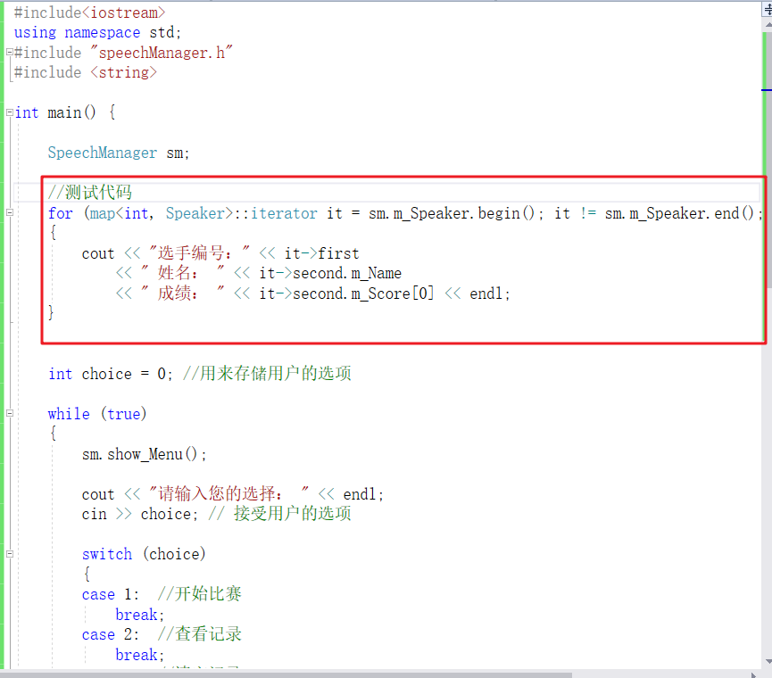

* 测试效果如图：

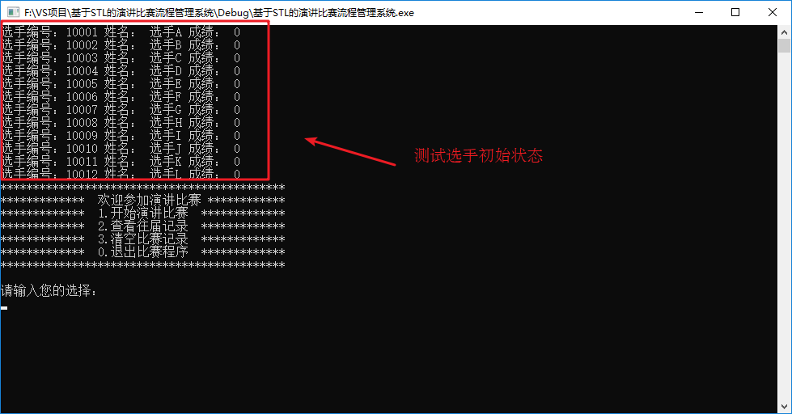

* 测试完毕后，可以将测试代码删除或注释。


#### 6.3.4 开始比赛成员函数添加

* 在speechManager.h中提供开始比赛的的成员函数 `void startSpeech();`
* 该函数功能是主要控制比赛的流程

```C++
	//开始比赛 - 比赛流程控制
	void startSpeech();
```


* 在speechManager.cpp中将startSpeech的空实现先写入
* 我们可以先将整个比赛的流程 写到函数中

```C++
//开始比赛
void SpeechManager::startSpeech()
{
	//第一轮比赛
	//1、抽签
	
	//2、比赛

	//3、显示晋级结果

	//第二轮比赛

	//1、抽签

	//2、比赛

	//3、显示最终结果

	//4、保存分数
}

```


#### 6.3.5 抽签

**功能描述：**

* 正式比赛前，所有选手的比赛顺序需要打乱，我们只需要将存放选手编号的容器  打乱次序即可


* 在speechManager.h中提供抽签的的成员函数 `void speechDraw();`

```C++
	//抽签
	void speechDraw();
```


- 在speechManager.cpp中实现成员函数 `void speechDraw();`

```C++
void SpeechManager::speechDraw()
{
	cout << "第 << " << this->m_Index << " >> 轮比赛选手正在抽签"<<endl;
	cout << "---------------------" << endl;
	cout << "抽签后演讲顺序如下：" << endl;
	if (this->m_Index == 1)
	{
		random_shuffle(v1.begin(), v1.end());
		for (vector<int>::iterator it = v1.begin(); it != v1.end(); it++)
		{
			cout << *it << " ";
		}
		cout << endl;
	}
	else
	{
		random_shuffle(v2.begin(), v2.end());
		for (vector<int>::iterator it = v2.begin(); it != v2.end(); it++)
		{
			cout << *it << " ";
		}
		cout << endl;
	}
	cout << "---------------------" << endl;
	system("pause");
	cout << endl;
}
```


* 在startSpeech比赛流程控制的函数中，调用抽签函数

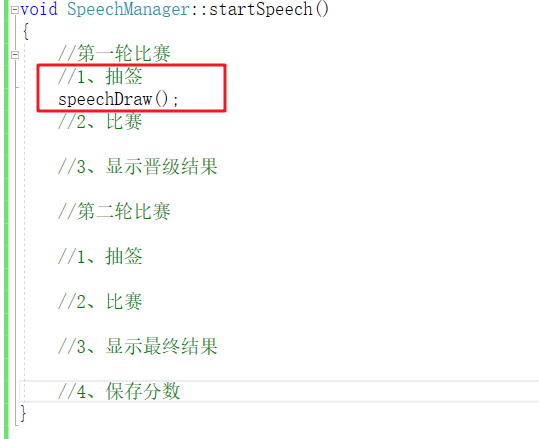

* 在main函数中，分支1选项中，调用开始比赛的接口

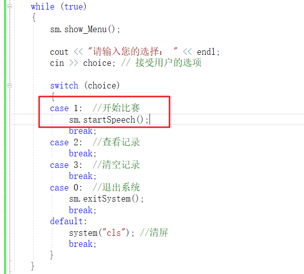


* 测试


#### 6.3.6 开始比赛

* 在speechManager.h中提供比赛的的成员函数 `void speechContest();`

```C++
	//比赛
	void speechContest();
```


* 在speechManager.cpp中实现成员函数 `void speechContest();`

```C++
void SpeechManager::speechContest()
{
	cout << "------------- 第"<< this->m_Index << "轮正式比赛开始：------------- " << endl;

	multimap<double, int, greater<int>> groupScore; //临时容器，保存key分数 value 选手编号

	int num = 0; //记录人员数，6个为1组

	vector <int>v_Src;   //比赛的人员容器
	if (this->m_Index == 1)
	{
		v_Src = v1;
	}
	else
	{
		v_Src = v2;
	}

	//遍历所有参赛选手
	for (vector<int>::iterator it = v_Src.begin(); it != v_Src.end(); it++)
	{
		num++;

		//评委打分
		deque<double>d;
		for (int i = 0; i < 10; i++)
		{
			double score = (rand() % 401 + 600) / 10.f;  // 600 ~ 1000
			//cout << score << " ";
			d.push_back(score);
		}

		sort(d.begin(), d.end(), greater<double>());				//排序
		d.pop_front();												//去掉最高分
		d.pop_back();												//去掉最低分

		double sum = accumulate(d.begin(), d.end(), 0.0f);				//获取总分
		double avg = sum / (double)d.size();									//获取平均分

		//每个人平均分
		//cout << "编号： " << *it  << " 选手： " << this->m_Speaker[*it].m_Name << " 获取平均分为： " << avg << endl;  //打印分数
		this->m_Speaker[*it].m_Score[this->m_Index - 1] = avg;

		//6个人一组，用临时容器保存
		groupScore.insert(make_pair(avg, *it));
		if (num % 6 == 0)
		{

			cout << "第" << num / 6 << "小组比赛名次：" << endl;
			for (multimap<double, int, greater<int>>::iterator it = groupScore.begin(); it != groupScore.end(); it++)
			{
				cout << "编号: " << it->second << " 姓名： " << this->m_Speaker[it->second].m_Name << " 成绩： " << this->m_Speaker[it->second].m_Score[this->m_Index - 1] << endl;
			}

			int count = 0;
			//取前三名
			for (multimap<double, int, greater<int>>::iterator it = groupScore.begin(); it != groupScore.end() && count < 3; it++, count++)
			{
				if (this->m_Index == 1)
				{
					v2.push_back((*it).second);
				}
				else
				{
					vVictory.push_back((*it).second);
				}
			}

			groupScore.clear();

			cout << endl;

		}
	}
	cout << "------------- 第" << this->m_Index << "轮比赛完毕  ------------- " << endl;
	system("pause");
}
```


* 在startSpeech比赛流程控制的函数中，调用比赛函数

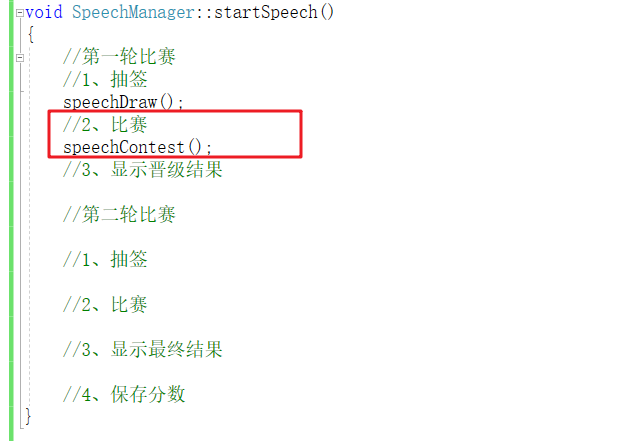


* 再次运行代码，测试比赛

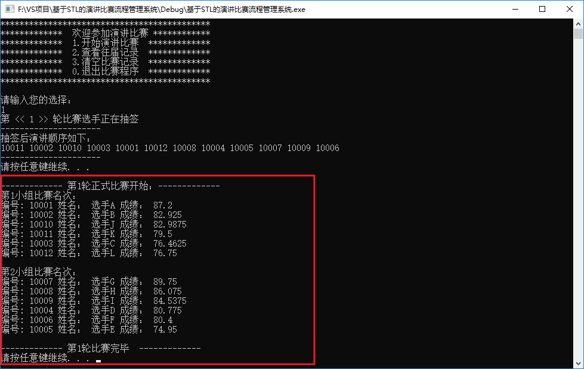


#### 6.3.7 显示比赛分数

* 在speechManager.h中提供比赛的的成员函数 `void showScore();`

```C++
	//显示比赛结果
	void showScore();
```


* 在speechManager.cpp中实现成员函数 `void  showScore();`

```C++
void SpeechManager::showScore()
{
	cout << "---------第" << this->m_Index << "轮晋级选手信息如下：-----------" << endl;
	vector<int>v;
	if (this->m_Index == 1)
	{
		v = v2;
	}
	else
	{
		v = vVictory;
	}

	for (vector<int>::iterator it = v.begin(); it != v.end(); it++)
	{
		cout << "选手编号：" << *it << " 姓名： " << m_Speaker[*it].m_Name << " 得分： " << m_Speaker[*it].m_Score[this->m_Index - 1] << endl;
	}
	cout << endl;

	system("pause");
	system("cls");
	this->show_Menu(); 
}
```

* 在startSpeech比赛流程控制的函数中，调用显示比赛分数函数

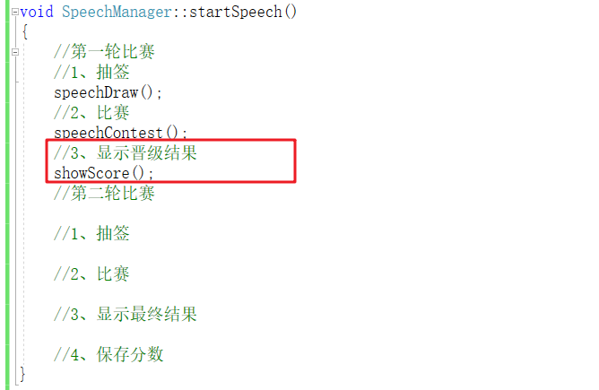

* 运行代码，测试效果

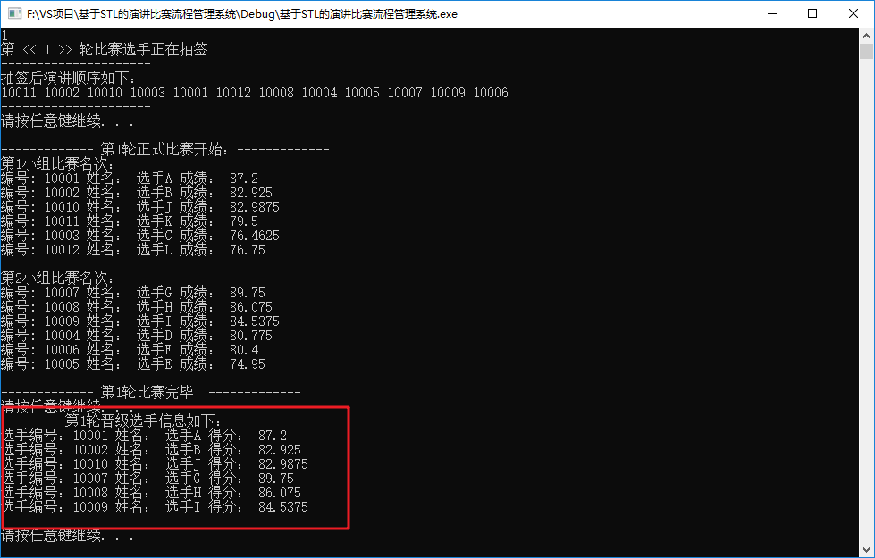


#### 6.3.8 第二轮比赛

第二轮比赛流程同第一轮，只是比赛的轮是+1，其余流程不变

* 在startSpeech比赛流程控制的函数中，加入第二轮的流程

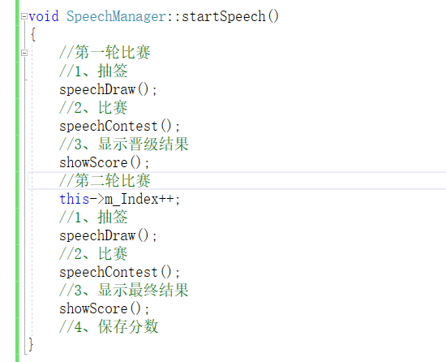


测试，将整个比赛流程都跑通

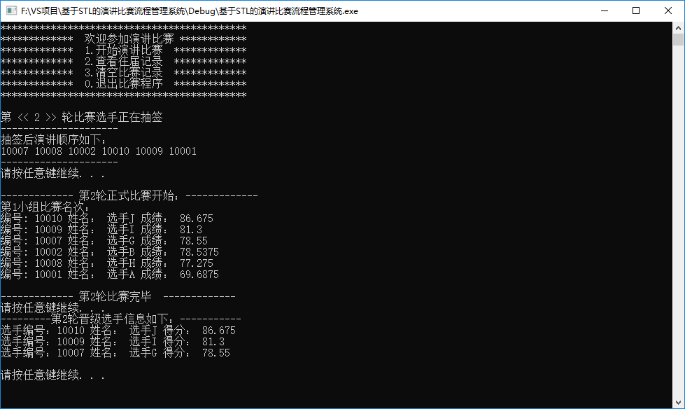


### 6.4 保存分数

**功能描述：**

* 将每次演讲比赛的得分记录到文件中

**功能实现：**

* 在speechManager.h中添加保存记录的成员函数 `void saveRecord();`

```C++
	//保存记录
	void saveRecord();
```


* 在speechManager.cpp中实现成员函数 `void saveRecord();`

```C++
void SpeechManager::saveRecord()
{
	ofstream ofs;
	ofs.open("speech.csv", ios::out | ios::app); // 用输出的方式打开文件  -- 写文件

	//将每个人数据写入到文件中
	for (vector<int>::iterator it = vVictory.begin(); it != vVictory.end(); it++)
	{
		ofs << *it << ","
			<< m_Speaker[*it].m_Score[1] << ",";
	}
	ofs << endl;
    
	//关闭文件
	ofs.close();
    
	cout << "记录已经保存" << endl;
}
```


* 在startSpeech比赛流程控制的函数中，最后调用保存记录分数函数

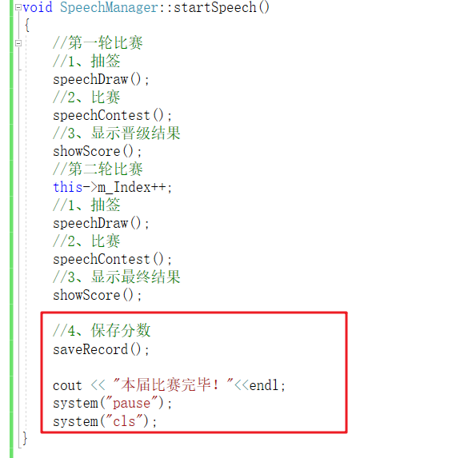


* 测试，整个比赛完毕后记录保存情况

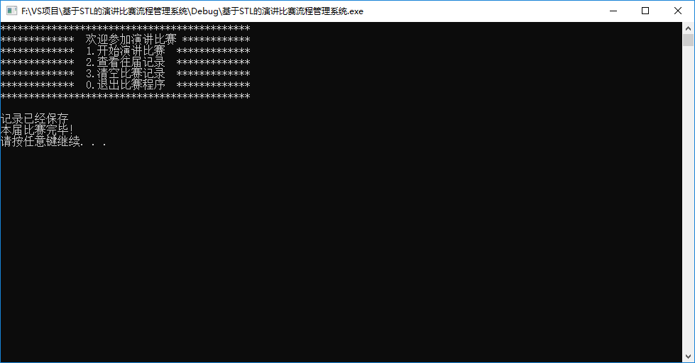


利用记事本打开文件 speech.csv，里面保存了前三名选手的编号以及得分

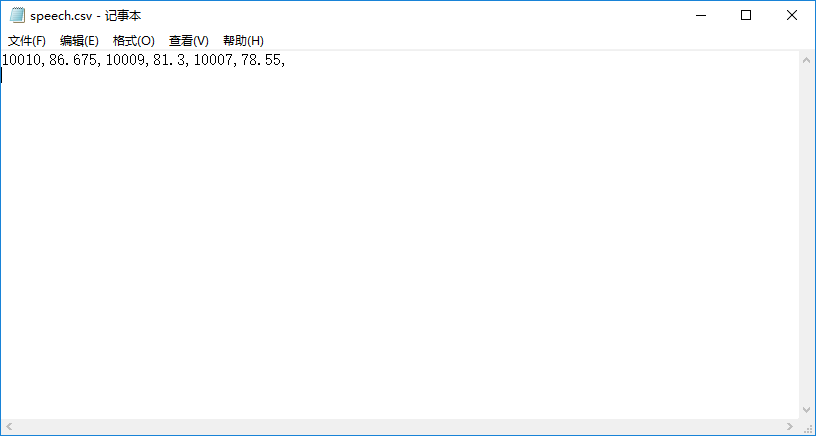


至此，整个演讲比赛功能制作完毕！


## 7、 查看记录

### 7.1 读取记录分数


* 在speechManager.h中添加保存记录的成员函数 `void loadRecord();`
* 添加判断文件是否为空的标志  `bool fileIsEmpty;`
* 添加往届记录的容器`map<int, vector<string>> m_Record;`   

其中m_Record 中的key代表第几届，value记录具体的信息

```C++
	//读取记录
	void loadRecord();

	//文件为空的标志
	bool fileIsEmpty;

	//往届记录
	map<int, vector<string>> m_Record;
```


* 在speechManager.cpp中实现成员函数 `void loadRecord();`

```C++
void SpeechManager::loadRecord()
{
	ifstream ifs("speech.csv", ios::in); //输入流对象 读取文件

	if (!ifs.is_open())
	{
		this->fileIsEmpty = true;
		cout << "文件不存在！" << endl;
		ifs.close();
		return;
	}

	char ch;
	ifs >> ch;
	if (ifs.eof())
	{
		cout << "文件为空!" << endl;
		this->fileIsEmpty = true;
		ifs.close();
		return;
	}

	//文件不为空
	this->fileIsEmpty = false;

	ifs.putback(ch); //读取的单个字符放回去

	string data;
	int index = 0;
	while (ifs >> data)
	{
		//cout << data << endl;
		vector<string>v;

		int pos = -1;
		int start = 0;

		while (true)
		{
			pos = data.find(",", start); //从0开始查找 ','
			if (pos == -1)
			{
				break; //找不到break返回
			}
			string tmp = data.substr(start, pos - start); //找到了,进行分割 参数1 起始位置，参数2 截取长度
			v.push_back(tmp);
			start = pos + 1;
		}

		this->m_Record.insert(make_pair(index, v));
		index++;
	}

	ifs.close();
}
```


* 在SpeechManager构造函数中调用获取往届记录函数

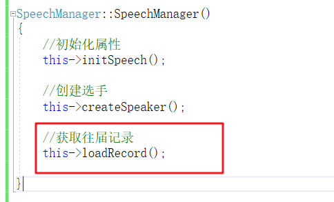


### 7.2 查看记录功能

* 在speechManager.h中添加保存记录的成员函数 `void showRecord();`

```C++
	//显示往届得分
	void showRecord();
```


* 在speechManager.cpp中实现成员函数 `void showRecord();`

```C++
void SpeechManager::showRecord()
{
	for (int i = 0; i < this->m_Record.size(); i++)
	{
		cout << "第" << i + 1 << "届 " <<
			"冠军编号：" << this->m_Record[i][0] << " 得分：" << this->m_Record[i][1] << " "
			"亚军编号：" << this->m_Record[i][2] << " 得分：" << this->m_Record[i][3] << " "
			"季军编号：" << this->m_Record[i][4] << " 得分：" << this->m_Record[i][5] << endl;
	}
    system("pause");
	system("cls");
}
```


### 7.3 测试功能

在main函数分支 2  选项中，调用查看记录的接口

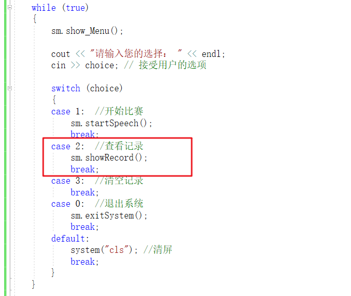

显示效果如图：（本次测试添加了4条记录）

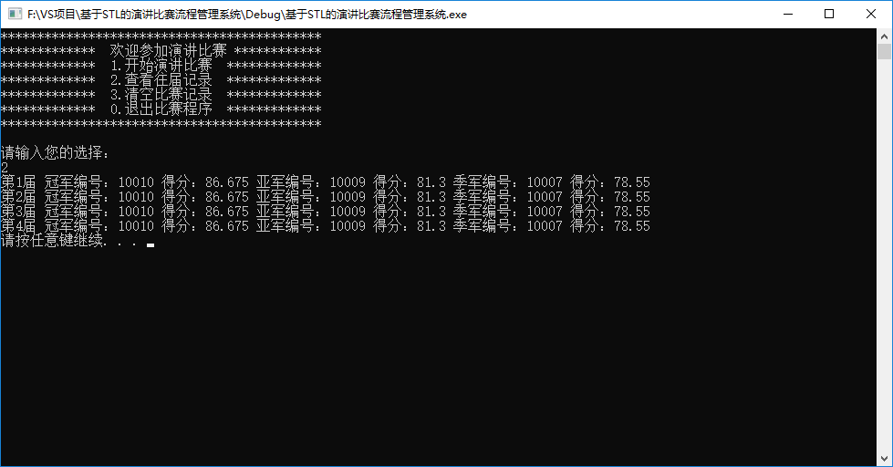


### 7.4 bug解决

目前程序中有几处bug未解决：

1. 查看往届记录，若文件不存在或为空，并未提示

解决方式：在showRecord函数中，开始判断文件状态并加以判断

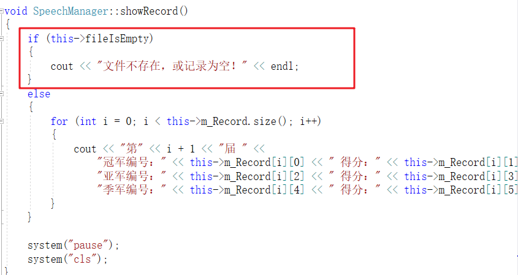


2. 若记录为空或不存在，比完赛后依然提示记录为空

解决方式：saveRecord中更新文件为空的标志

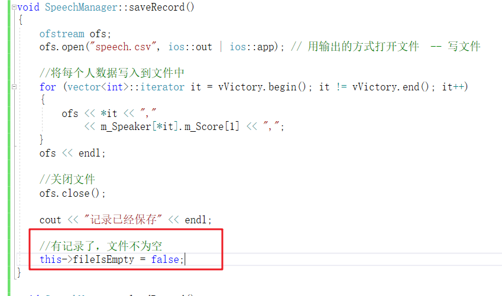

3. 比完赛后查不到本届比赛的记录，没有实时更新

解决方式：比赛完毕后，所有数据重置

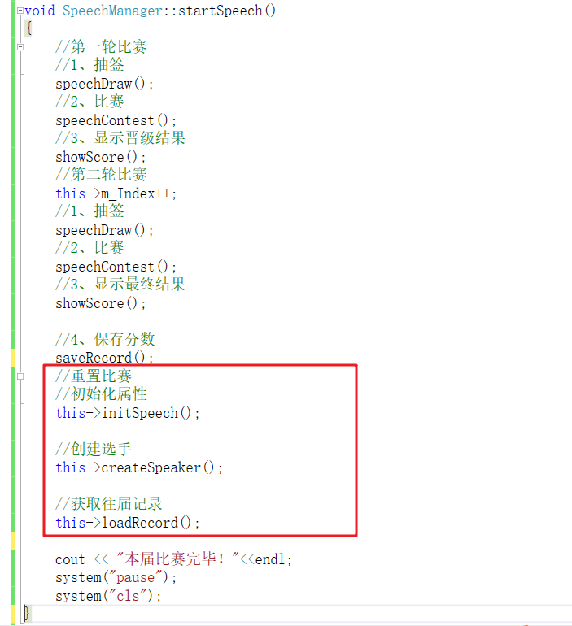


4. 在初始化时，没有初始化记录容器

解决方式：initSpeech中添加 初始化记录容器

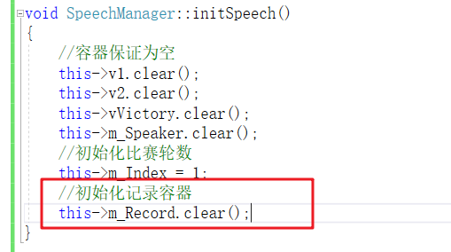

5. 每次记录都是一样的

解决方式：在main函数一开始 添加随机数种子

```C++
srand((unsigned int)time(NULL));
```


所有bug解决后 测试：

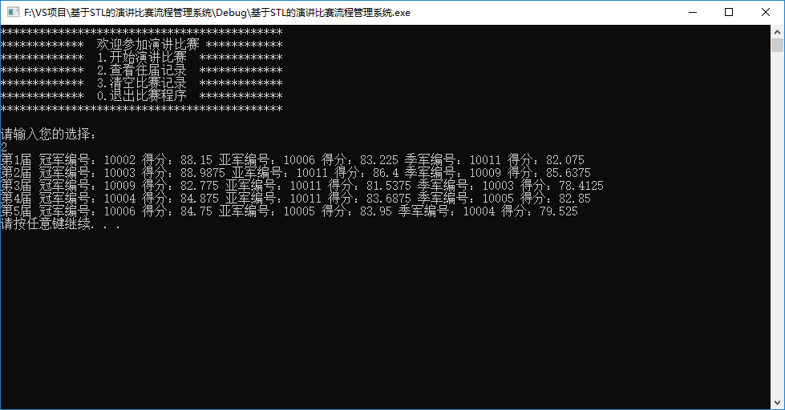


## 8、 清空记录

### 8.1 清空记录功能实现

* 在speechManager.h中添加保存记录的成员函数 `void clearRecord();`

```C++
	//清空记录
	void clearRecord();
```


* 在speechManager.cpp中实现成员函数 `void clearRecord();`

```C++
void SpeechManager::clearRecord()
{
	cout << "确认清空？" << endl;
	cout << "1、确认" << endl;
	cout << "2、返回" << endl;

	int select = 0;
	cin >> select;

	if (select == 1)
	{
		//打开模式 ios::trunc 如果存在删除文件并重新创建
		ofstream ofs("speech.csv", ios::trunc);
		ofs.close();

		//初始化属性
		this->initSpeech();

		//创建选手
		this->createSpeaker();

		//获取往届记录
		this->loadRecord();
		

		cout << "清空成功！" << endl;
	}

	system("pause");
	system("cls");
}
```

### 8.2 测试清空

在main函数分支 3  选项中，调用清空比赛记录的接口

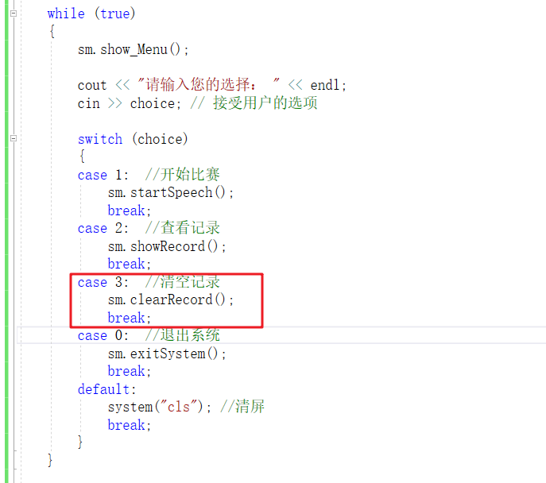

运行程序，测试清空记录：

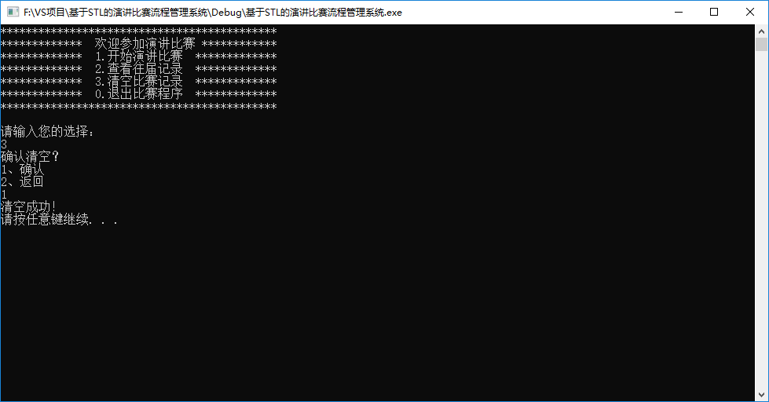

speech.csv中记录也为空

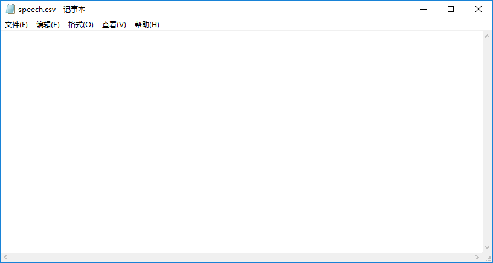


* 至此本案例结束！ `^_^`